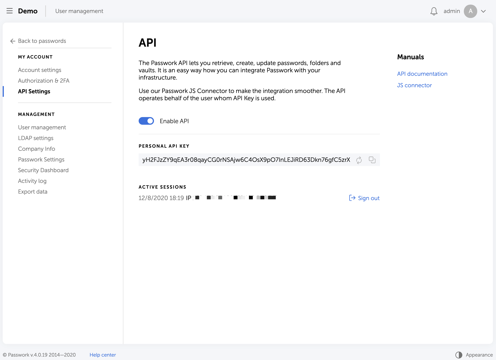

## About the API
The Passwork API lets you retrieve, create, update passwords, folders and vaults. It is an easy way how you can integrate Passwork with your infrastructure. Use our Passwork JS Connector to make the integration smoother. The API operates behalf of the user whom API Key is used.

## Documentation

#### How to install
```shell script
git clone git@github.com:passwork-me/js-connector.git .
npm install
```

#### API Key



- Sign in to your Passwork
- Menu → API Settings
- Enter your authorization key and generate the API Key

Keep the API Key in secret. Use method `login(...)` to retrieve a temporary API Token.
The API Token is a session token. It lives while you are calling the API and then it gets expired and you will need to `login` again.
API Token Lifetime can be set up in your Passwork.
The API Token is stored in `passswork` instance under the hood and sent in HTTP Header. 


Check for all available methods in
[Passwork API Methods](./src/passwork-interface.js)

#### Open session

```JS
/** @type PassworkAPI */
const passwork = new Passwork("https://passwork/api/v4");
(async () => {
    await passwork.login("api-key", "master password");

    // do what you need here

    await passwork.logout();
})();
```


A session lives for 10 mins (can be customized).
So you can perform multiple actions within one session without executing `login`.

### Examples
Get password by ID

```JS
const passwork = new Passwork("https://passwork/api/v4");
(async () => {
    await passwork.login("api-key", "master password");
    let password = await passwork.getPassword("password-id");
    await passwork.logout();
})();
```

[More examples here](./examples)


### License
This project is licensed under the terms of the MIT license.